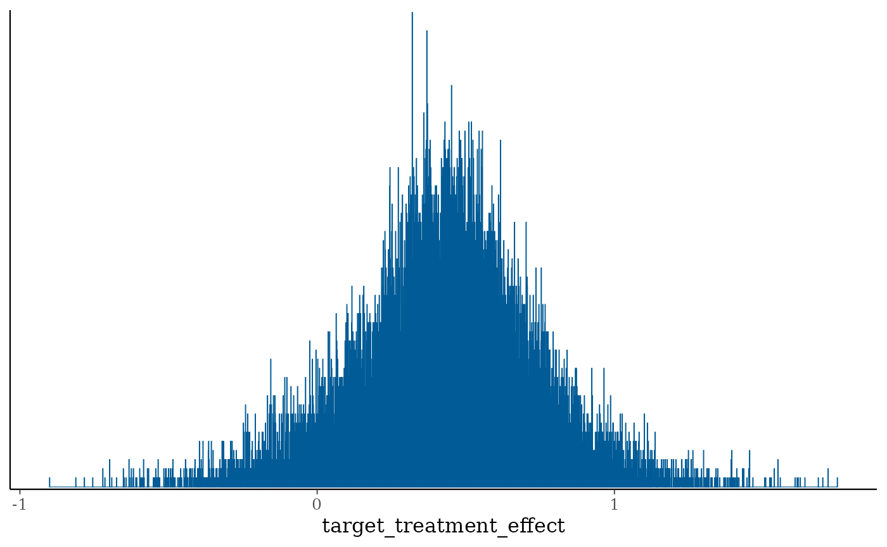
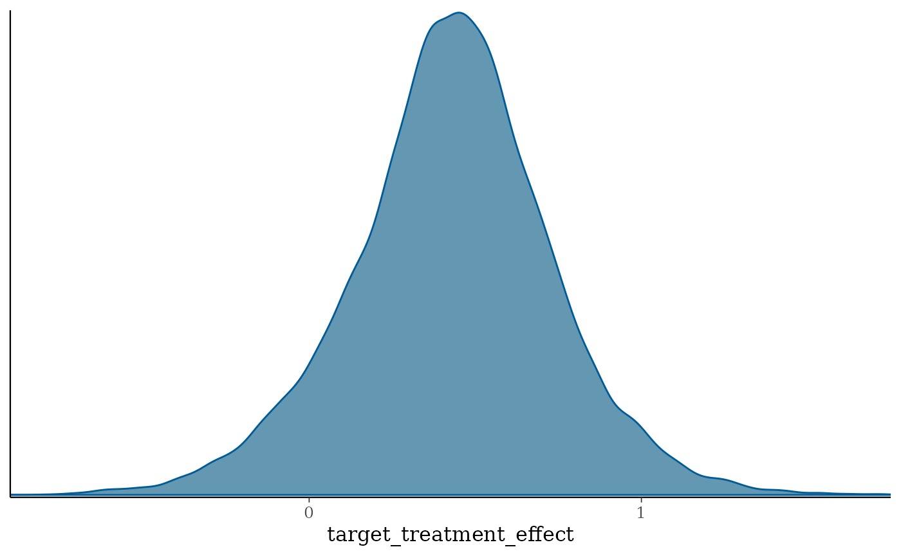
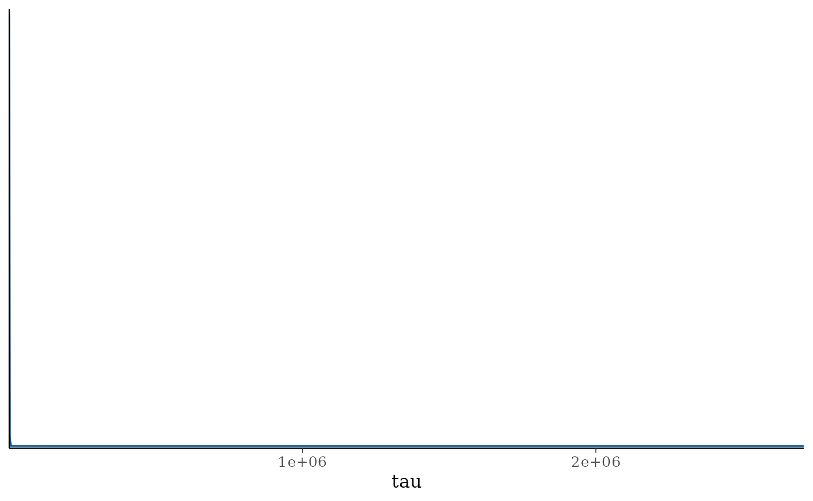
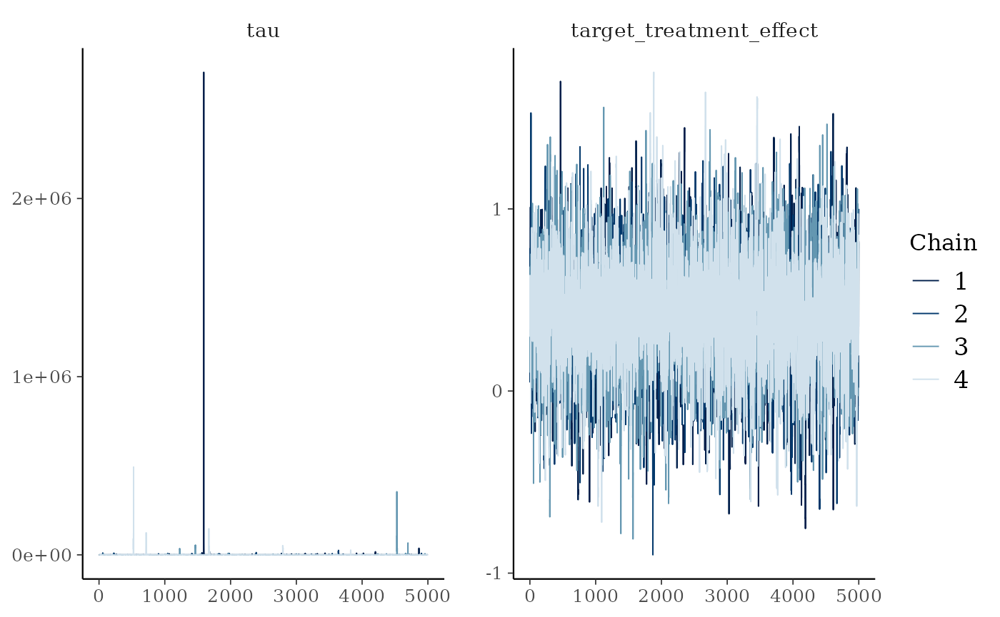
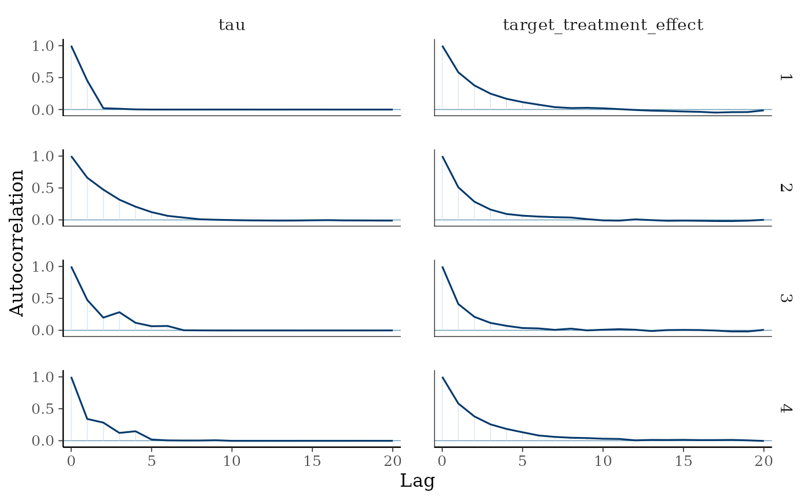

# Commensurate Prior

## Introduction

This vignette describes an implementation of the Commensurate Prior, the
location commensurate model of [Hobbs et al
(2011)](https://onlinelibrary.wiley.com/doi/10.1111/j.1541-0420.2011.01564.x)
*without* its power parameter. See the Commensurate Power Prior vignette
for the variant that carries one.

## Set working directory, import functions and configurations

List packages to load, and install them if necessary.

## Mathematical description of the model

The source data inform $`\theta_S`$ through their own likelihood,
undiscounted, and the target parameter is tied to it by a
commensurability precision $`\tau`$:

``` math
 \pi(\theta_T, \tau| \mathbf{D_S}) 
 = \int \pi(\theta_T|\theta_S, \tau) \frac{\mathcal{L}(\theta_S | \mathbf{D}_S) \pi_0(\theta_S)}{\int \mathcal{L}(\theta_S | \mathbf{D}_S) \pi_0(\theta_S) d\theta_S}d\theta_S \times p(\tau) 
```

where $`\pi_0(\theta_S)`$ is an initial prior for $`\theta_S`$ and

``` math
\theta_T|\theta_S, \tau \sim \mathcal{N}\left(\theta_S, \frac{1}{\tau}\right).
```

This is the commensurate power prior at $`\gamma \equiv 1`$: the Beta
prior on the power parameter disappears, and with it the second route by
which that model adapts the amount of borrowing. Here the borrowing is
governed by $`p(\tau)`$ alone. Small $`\tau`$ inflates the variance of
the prior for $`\theta_T`$ and so discounts the source; large $`\tau`$
pulls $`\theta_T`$ towards $`\theta_S`$.

## Gaussian case

With a noninformative initial prior and a Gaussian likelihood,
integrating out $`\theta_S`$ leaves a prior that is normal conditional
on $`\tau`$:

``` math
\theta_T \mid \mathbf{D}_S, \tau \sim \mathcal{N}\left(\hat{\theta}_S,\ \frac{1}{\tau} + \frac{\hat{\sigma}_S^2}{N_S}\right),
```

and equation (9) of Hobbs et al (2011), evaluated at $`\gamma = 1`$,
gives

``` math
 p\left(\theta_T \mid \mathbf{D}_{S}, \mathbf{D}_T, \tau, \sigma^2\right) \propto N\left(\theta_T \left\lvert\, \frac{N_S \tau \sigma^2 \hat{\theta}_S+N_T u \hat{\theta}_T}{N_S \tau \sigma^2+N_T u}\right., \frac{u \sigma^2}{N_S \tau \sigma^2+ N_T u}\right) 
```

where $`u=N_S+\hat{\sigma}_S^2 \tau`$, and

``` math
p\left(\tau \mid \mathbf{D}_S, \mathbf{D}_T, \sigma^2\right) \propto  N\left(\hat{\theta}_T-\hat{\theta}_S \mid 0, \frac{\sigma^2}{N_T}+\frac{1}{\tau}+\frac{\hat{\sigma}_S^2}{N_S}\right) \times \pi(\tau) .
```

Because the posterior is an ordinary conjugate update of a normal
mixture over $`\tau`$, the simulation does not fit this model with Stan
for every replicate: `vectorised_replicate_inference()` discretises
$`p(\tau)`$ on a quadrature rule and updates the whole mixture at once.
The Stan program below remains the reference implementation, and is what
`inference()` uses for a single data set.

## Implementation of the model in Stan

``` r

case_study_config <- yaml::yaml.load_file(system.file("conf/case_studies/belimumab.yml", package = "BExTE"))


source_data <- ObservedSourceData$new(case_study_config)
summary_measure_likelihood <- case_study_config$summary_measure_likelihood
endpoint <- case_study_config$endpoint

target_data <- ObservedTargetData$new(treatment_effect_estimate = case_study_config$target$treatment_effect, treatment_effect_standard_error = case_study_config$target$standard_error, target_sample_size_per_arm = as.integer(case_study_config$target$total / 2), summary_measure_likelihood = case_study_config$summary_measure_likelihood)
```

``` r

method_parameters <- list(
  initial_prior = "noninformative", # The posterior for the source data is derived from an uninformative prior, for consistency with the other methods.
  heterogeneity_prior = list(family = "inverse_gamma", alpha = 1 / 3, beta = 1)
  # list(family = "half_normal", std_dev = 5)
  # list(family = "cauchy", location = 0, scale = 10)
)

env = "full"
config_dir <- paste0(system.file(paste0("conf/", env), package = "BExTE"), "/")
mcmc_config <- yaml::read_yaml(paste0(config_dir, "/mcmc_config.yml"))

model <- Model$new()

model <- model$create(
  case_study_config = case_study_config,
  method = "commensurate_prior",
  method_parameters = method_parameters,
  source_data = source_data,
  mcmc_config = mcmc_config
)

print(model$stan_model_code)
```

    ## [1] "\n                                      data {\n                                        int<lower=0,upper=2> prior_type; // Type of prior on the commensurability parameter; 0 for inverse_gamma, 1 for half normal, 2 for Cauchy\n                                        int<lower=1> NS;       // Number of samples in dataset S\n                                        int<lower=1> NT;       // Number of samples in dataset T\n                                        real<lower=0> target_sampling_variance;  // Known variance of the target data\n                                        real<lower=0> prior_variance; // Prior variance component\n                                        real source_treatment_effect_estimate;      // Estimate from dataset S\n                                        real target_treatment_effect_estimate;      // Estimate from dataset T\n                                        real std_dev; // Parameter for the half normal prior\n                                        real location; // Location parameter for the Cauchy prior\n                                        real scale; // Scale parameter for the Cauchy prior\n                                        real alpha; // Parameter for the inverse_gamma prior\n                                        real beta; // Pocation parameter for the inverse_gamma prior\n                                      }\n\n                                      parameters {\n                                        // Sampled on the log scale, which Stan's <lower=0> transform on tau\n                                        // already did internally, so that tau itself is never formed where\n                                        // it would overflow: a Cauchy(0, 30) prior on log(tau) puts about 3%\n                                        // of its mass beyond log(tau) = +-709, the limit of exp().\n                                        real log_tau;     // Log commensurability parameter\n                                        real target_treatment_effect;          // Target treatment effect\n                                      }\n\n                                      model {\n                                        // Local to the model block, as in the power prior variant, and\n                                        // likewise written in 1 / tau so that they stay finite however\n                                        // large tau grows.\n                                        // Capped so that no product below overflows. The marginal\n                                        // likelihood weights log(tau) < -600 by about exp(-300), so\n                                        // the cap moves no posterior mass that a double can represent.\n                                        real inverse_tau = exp(fmin(-log_tau, 600));\n                                        real u_over_tau = NS * inverse_tau + prior_variance;\n                                        real denominator = NS * target_sampling_variance + NT * u_over_tau;\n                                        real marginal_variance = target_sampling_variance / NT\n                                                                  + inverse_tau\n                                                                  + prior_variance / NS;\n\n                                        // Priors\n                                        // Each prior is stated on its own quantity and carried to log_tau\n                                        // by the log Jacobian of that change of variables; constant terms\n                                        // are dropped.\n                                        if (prior_type == 0) {\n                                          // tau^2 ~ InvGamma(alpha, beta). With s = log(tau^2) = 2 * log_tau\n                                          // the density of s is inv_gamma_lpdf(exp(s)) + s, which reduces to\n                                          // -alpha * s - beta * exp(-s); ds / dlog_tau = 2 is constant.\n                                          // Writing it out avoids forming tau^2, which overflows at the\n                                          // log(tau) of about 354 that alpha = 1/1000 reaches.\n                                          target += -2 * alpha * log_tau - beta * exp(-2 * log_tau);\n                                        } else if (prior_type == 1){\n                                          // tau ~ HN(std_dev), plus the log Jacobian of tau = exp(log_tau).\n                                          // The half-normal's normalising constant is fixed by the data.\n                                          target += normal_lpdf(exp(log_tau) | 0, std_dev) + log_tau;\n                                        } else if (prior_type == 2){\n                                          // The prior is on log_tau itself, so there is no Jacobian.\n                                          log_tau ~ cauchy(location, scale);\n                                        }\n\n                                        // Marginal target-data likelihood for the commensurability\n                                        // parameter. With the conditional distribution below this is\n                                        // equation (9) of Hobbs et al. (2011) at gamma = 1. Omitting it\n                                        // would leave tau distributed according to its prior.\n                                        target_treatment_effect_estimate ~ normal(\n                                          source_treatment_effect_estimate,\n                                          sqrt(marginal_variance));\n\n                                        // Numerator and denominator divided by tau, as in the power\n                                        // prior variant.\n                                        target_treatment_effect ~ normal(\n    (NS * target_sampling_variance * source_treatment_effect_estimate + NT * u_over_tau * target_treatment_effect_estimate) /\n    denominator,\n    sqrt(u_over_tau * target_sampling_variance / denominator));\n                                      }\n\n                                      generated quantities {\n                                        real tau = exp(log_tau);     // Commensurability parameter\n                                      }\n                                      "

``` r

model$inference(target_data)
```

In the inference method, the data are prepared for use with Stan using
the same `prepare_data()` as the commensurate power prior - the two Stan
programs share a data block:

``` r

data <- model$prepare_data(target_data)
```

Then, draws are sampled from the posterior following the configuration
specified in mcmc_config.

``` r

bayesplot::mcmc_hist(model$fit$draws("target_treatment_effect"), binwidth = 0.001)
```



``` r

posterior <- model$fit$draws("target_treatment_effect")
bayesplot::color_scheme_set("blue")
bayesplot::mcmc_dens(posterior, pars = c("target_treatment_effect"))
```



Posterior distribution of the heterogeneity parameter. There is no power
parameter to plot alongside it:

``` r

posterior <- model$fit$draws("tau")
bayesplot::color_scheme_set("blue")
bayesplot::mcmc_dens(posterior, pars = c("tau"))
```



``` r

library(posterior)
draws_array <- as_draws_array(model$fit)
```

``` r

library(bayesplot)
mcmc_trace(draws_array, pars = c("tau", "target_treatment_effect"))
```



``` r

mcmc_acf(draws_array, pars = c("tau", "target_treatment_effect"))
```



``` r

mcmc_diagnostics <- model$fit$diagnostic_summary()

n_draws <- mcmc_config$chain_length * mcmc_config$num_chains

# MCMC Effective Sample Size
mcmc_ess <- bayesplot::neff_ratio(model$fit) * n_draws

mcmc_ess <- mcmc_ess[["target_treatment_effect"]]
print(mcmc_ess)
```

    ## [1] 5151.52

``` r

rhat_values <- bayesplot::rhat(model$fit)
rhat <- rhat_values["target_treatment_effect"]
print(rhat)
```

    ## target_treatment_effect 
    ##                1.000763

``` r

# number of divergences reported is the sum of the per chain values
n_divergences <- sum(mcmc_diagnostics$num_divergent)
print(n_divergences)
```

    ## [1] 69
