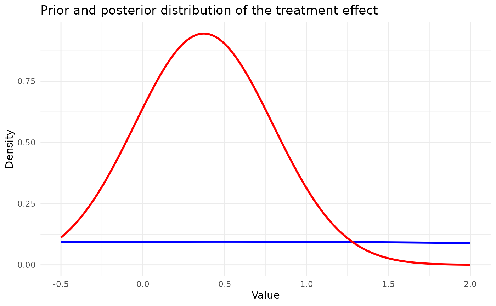
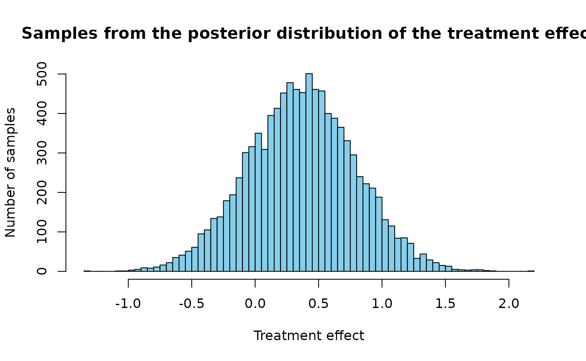

# Implementation of the PDCCPP

## Introduction

The aim of this document is to illustrate the PDCCPP ([Nikolakopoulos et
al (2018)](https://onlinelibrary.wiley.com/doi/10.1111/biom.12835)), the
empirical Bayes power prior (as proposed by [Gravestock et al
(2017)](https://onlinelibrary.wiley.com/doi/10.1002/pst.1814)), and the
p-value based power prior ([Liu et al,
(2018)](https://pubmed.ncbi.nlm.nih.gov/29125220/)).

## Set working directory, import functions

## Load the Belimumab case study configuration

Load the simulation configuration and the Belimumab case study
configuration from YAML files.

``` r

set.seed(42)
config_path <- system.file("conf/simulation_config.yml", package = "BExTE")
simulation_config <- yaml::yaml.load_file(config_path)

config_path <- system.file("conf/case_studies/belimumab.yml", package = "BExTE")
case_study_config <- yaml::yaml.load_file(config_path)
```

## Create data objects

Create a source_data instance, where information about the source data
is stored

``` r

target_sample_size_per_arm <- as.integer(case_study_config$target$total / 2)
drift <- 0.4

source_data <- ObservedSourceData$new(case_study_config)
print(source_data$to_dict())
```

    ## $source_treatment_effect_estimate
    ## [1] 0.480132
    ## 
    ## $source_standard_error
    ## [1] 0.1207175
    ## 
    ## $endpoint
    ## [1] "binary"
    ## 
    ## $summary_measure_likelihood
    ## [1] "normal"
    ## 
    ## $source_sample_size_control
    ## [1] 562
    ## 
    ## $source_sample_size_treatment
    ## [1] 563
    ## 
    ## $equivalent_source_sample_size_per_arm
    ## [1] 562.4996
    ## 
    ## $source_control_rate
    ## [1] 0.3879004
    ## 
    ## $source_treatment_rate
    ## [1] 0.5062167

Set the observed target data (in the paediatrics population)

``` r

summary_measure_likelihood <- case_study_config$summary_measure_likelihood
endpoint <- case_study_config$endpoint
target_data <- ObservedTargetData$new(treatment_effect_estimate = case_study_config$target$treatment_effect, treatment_effect_standard_error = case_study_config$target$standard_error, target_sample_size_per_arm = as.integer(case_study_config$target$total / 2), summary_measure_likelihood = case_study_config$summary_measure_likelihood)
```

## PDCCPP

We note that the PDCCPP method was developed in the Gaussian case only,
assuming that the sampling standard deviation is known and is the same
in the source and target studies. However, in our simulation study, we
do not make this latter assumption. To reuse the code by [Nikolakopoulos
et al (2018)](https://onlinelibrary.wiley.com/doi/10.1111/biom.12835),
what we adapt the sample size per arm in the source study by replacing
it with an “effective sample size per arm at variance $`\sigma_T^2`$,
$`N_0`$: We set: $`N_0 = N_S\frac{\sigma_T^2}{\sigma_S^2}`$ So that
everything is equivalent to the case where the sampling std is
$`\sigma_T`$ in the target study and the source study, but with a sample
size per arm $`N_0`$ in the source study (instead of $`N_S`$)

``` r

method <- "PDCCPP"
method_parameters <- list(
  initial_prior = "noninformative", # This corresponds to the fact that the posterior for the adults data is derived from an uninformative prior (for consistency with other methods). May be removed in future releases.
  empirical_bayes = FALSE, # Corresponds to whether some parameters of the prior are based on observed data.
  desired_tie = 0.065,
  significance_level = 0.05,
  tolerance = 0.0001,
  n_iter = 1e6
)
```

Now, we define the model we want to use for inferring the treatment
effect in the target study.

``` r

env <- "full"
config_dir <- paste0(system.file(paste0("conf/", env), package = "BExTE"), "/")
mcmc_config <- yaml::read_yaml(paste0(config_dir, "/mcmc_config.yml"))

model <- Model$new()

model <- model$create(
  case_study_config = case_study_config,
  method = method,
  method_parameters = method_parameters,
  source_data = source_data,
  mcmc_config = mcmc_config
)
```

### Inference with the PDCCPP

To perform inference, we would simply use:

``` r

# Perform Bayesian inference based on observed target data.
model$inference(target_data = target_data)
```

    ## [1] "Success"

This inference step sets the power parameter $`\gamma`$, which is the
only parameter the PDCCPP estimates, and the moments of the posterior:

``` r

print(model$posterior_parameters$power_parameter) # Power parameter
```

    ## [1] 0.0008223686

``` r

print(model$post_mean) # Posterior mean
```

    ## [1] 0.3722536

``` r

print(model$post_var) # Posterior variance
```

    ## [1] 0.1781825

Now, let us see how this is implemented:

``` r

read_function_code(model$inference)
```

    ## $ <- function (target_data) 
    ## {
    ##     self$empirical_bayes_update(target_data)
    ##     return(super$inference(target_data))
    ## } model <- function (target_data) 
    ## {
    ##     self$empirical_bayes_update(target_data)
    ##     return(super$inference(target_data))
    ## } inference <- function (target_data) 
    ## {
    ##     self$empirical_bayes_update(target_data)
    ##     return(super$inference(target_data))
    ## }

The first step updates the prior based on the target data. For the
PDCCPP this is where the power parameter is chosen: it is a function of
the observed target estimate, which makes the PDCCPP an empirical Bayes
method.

``` r

read_function_code(model$empirical_bayes_update)
```

    ## $ <- function (target_data) 
    ## {
    ##     if (target_data$sample$treatment_effect_standard_error == 
    ##         Inf) {
    ##         stop("The standard error on the treatment effect is Inf")
    ##     }
    ##     self$posterior_parameters$power_parameter <- self$power_parameter_estimation(target_data = target_data)
    ##     self$prior_var <- power_prior_variance(self$prior$source$standard_error, 
    ##         self$posterior_parameters$power_parameter)
    ##     if (is.numeric(self$prior_var) && length(self$prior_var) == 
    ##         0) {
    ##         stop("self$prior_var is numeric(0)")
    ##     }
    ## } model <- function (target_data) 
    ## {
    ##     if (target_data$sample$treatment_effect_standard_error == 
    ##         Inf) {
    ##         stop("The standard error on the treatment effect is Inf")
    ##     }
    ##     self$posterior_parameters$power_parameter <- self$power_parameter_estimation(target_data = target_data)
    ##     self$prior_var <- power_prior_variance(self$prior$source$standard_error, 
    ##         self$posterior_parameters$power_parameter)
    ##     if (is.numeric(self$prior_var) && length(self$prior_var) == 
    ##         0) {
    ##         stop("self$prior_var is numeric(0)")
    ##     }
    ## } empirical_bayes_update <- function (target_data) 
    ## {
    ##     if (target_data$sample$treatment_effect_standard_error == 
    ##         Inf) {
    ##         stop("The standard error on the treatment effect is Inf")
    ##     }
    ##     self$posterior_parameters$power_parameter <- self$power_parameter_estimation(target_data = target_data)
    ##     self$prior_var <- power_prior_variance(self$prior$source$standard_error, 
    ##         self$posterior_parameters$power_parameter)
    ##     if (is.numeric(self$prior_var) && length(self$prior_var) == 
    ##         0) {
    ##         stop("self$prior_var is numeric(0)")
    ##     }
    ## }

The power parameter is set by the calibration of Nikolakopoulos et
al. (2018): it borrows as much as possible while keeping the type I
error of the resulting test at `desired_tie`.

``` r

read_function_code(model$power_parameter_estimation)
```

    ## $ <- function (target_data) 
    ## {
    ##     transformed_treatment_effects <- self$hypothesis_space_transformation(target_data$sample$treatment_effect_estimate)
    ##     source_treatment_effect_estimate <- transformed_treatment_effects$source_treatment_effect_estimate
    ##     target_treatment_effect_estimate <- transformed_treatment_effects$target_treatment_effect_estimate
    ##     target_data_sampling_variance <- target_data$sample$treatment_effect_standard_error^2 * 
    ##         target_data$sample_size_per_arm
    ##     calibration_parameter <- self$calibration_parameter(target_data_sampling_variance = target_data_sampling_variance, 
    ##         target_sample_size_per_arm = target_data$sample_size_per_arm, 
    ##         source_treatment_effect_estimate = source_treatment_effect_estimate)
    ##     assert_single_number(calibration_parameter)
    ##     power_parameter <- self$power_parameter_from_calibration(target_treatment_effect_estimate = target_treatment_effect_estimate, 
    ##         source_treatment_effect_estimate = source_treatment_effect_estimate, 
    ##         target_data_sampling_variance = target_data_sampling_variance, 
    ##         target_sample_size_per_arm = target_data$sample_size_per_arm, 
    ##         calibration_parameter = calibration_parameter)
    ##     if (is.null(power_parameter) || is.na(power_parameter)) {
    ##         stop("Variable is NULL or NA. Execution stopped.")
    ##     }
    ##     return(power_parameter)
    ## } model <- function (target_data) 
    ## {
    ##     transformed_treatment_effects <- self$hypothesis_space_transformation(target_data$sample$treatment_effect_estimate)
    ##     source_treatment_effect_estimate <- transformed_treatment_effects$source_treatment_effect_estimate
    ##     target_treatment_effect_estimate <- transformed_treatment_effects$target_treatment_effect_estimate
    ##     target_data_sampling_variance <- target_data$sample$treatment_effect_standard_error^2 * 
    ##         target_data$sample_size_per_arm
    ##     calibration_parameter <- self$calibration_parameter(target_data_sampling_variance = target_data_sampling_variance, 
    ##         target_sample_size_per_arm = target_data$sample_size_per_arm, 
    ##         source_treatment_effect_estimate = source_treatment_effect_estimate)
    ##     assert_single_number(calibration_parameter)
    ##     power_parameter <- self$power_parameter_from_calibration(target_treatment_effect_estimate = target_treatment_effect_estimate, 
    ##         source_treatment_effect_estimate = source_treatment_effect_estimate, 
    ##         target_data_sampling_variance = target_data_sampling_variance, 
    ##         target_sample_size_per_arm = target_data$sample_size_per_arm, 
    ##         calibration_parameter = calibration_parameter)
    ##     if (is.null(power_parameter) || is.na(power_parameter)) {
    ##         stop("Variable is NULL or NA. Execution stopped.")
    ##     }
    ##     return(power_parameter)
    ## } power_parameter_estimation <- function (target_data) 
    ## {
    ##     transformed_treatment_effects <- self$hypothesis_space_transformation(target_data$sample$treatment_effect_estimate)
    ##     source_treatment_effect_estimate <- transformed_treatment_effects$source_treatment_effect_estimate
    ##     target_treatment_effect_estimate <- transformed_treatment_effects$target_treatment_effect_estimate
    ##     target_data_sampling_variance <- target_data$sample$treatment_effect_standard_error^2 * 
    ##         target_data$sample_size_per_arm
    ##     calibration_parameter <- self$calibration_parameter(target_data_sampling_variance = target_data_sampling_variance, 
    ##         target_sample_size_per_arm = target_data$sample_size_per_arm, 
    ##         source_treatment_effect_estimate = source_treatment_effect_estimate)
    ##     assert_single_number(calibration_parameter)
    ##     power_parameter <- self$power_parameter_from_calibration(target_treatment_effect_estimate = target_treatment_effect_estimate, 
    ##         source_treatment_effect_estimate = source_treatment_effect_estimate, 
    ##         target_data_sampling_variance = target_data_sampling_variance, 
    ##         target_sample_size_per_arm = target_data$sample_size_per_arm, 
    ##         calibration_parameter = calibration_parameter)
    ##     if (is.null(power_parameter) || is.na(power_parameter)) {
    ##         stop("Variable is NULL or NA. Execution stopped.")
    ##     }
    ##     return(power_parameter)
    ## }

``` r

read_function_code(model$power_parameter_from_calibration)
```

    ## $ <- function (target_treatment_effect_estimate, source_treatment_effect_estimate, 
    ##     target_data_sampling_variance, target_sample_size_per_arm, 
    ##     calibration_parameter) 
    ## {
    ##     n0 <- self$prior$source$equivalent_source_sample_size_per_arm * 
    ##         target_data_sampling_variance/(self$prior$source$equivalent_source_sample_size_per_arm * 
    ##         self$prior$source$standard_error^2)
    ##     standard_deviation_predictive <- sqrt(target_data_sampling_variance/n0 + 
    ##         target_data_sampling_variance/target_sample_size_per_arm)
    ##     ifelse(((target_treatment_effect_estimate > (source_treatment_effect_estimate + 
    ##         standard_deviation_predictive * calibration_parameter))) | 
    ##         ((target_treatment_effect_estimate < (source_treatment_effect_estimate - 
    ##             standard_deviation_predictive * calibration_parameter))), 
    ##         ((target_data_sampling_variance/n0)/(((target_treatment_effect_estimate - 
    ##             source_treatment_effect_estimate)/calibration_parameter)^2 - 
    ##             target_data_sampling_variance/target_sample_size_per_arm)), 
    ##         1)
    ## } model <- function (target_treatment_effect_estimate, source_treatment_effect_estimate, 
    ##     target_data_sampling_variance, target_sample_size_per_arm, 
    ##     calibration_parameter) 
    ## {
    ##     n0 <- self$prior$source$equivalent_source_sample_size_per_arm * 
    ##         target_data_sampling_variance/(self$prior$source$equivalent_source_sample_size_per_arm * 
    ##         self$prior$source$standard_error^2)
    ##     standard_deviation_predictive <- sqrt(target_data_sampling_variance/n0 + 
    ##         target_data_sampling_variance/target_sample_size_per_arm)
    ##     ifelse(((target_treatment_effect_estimate > (source_treatment_effect_estimate + 
    ##         standard_deviation_predictive * calibration_parameter))) | 
    ##         ((target_treatment_effect_estimate < (source_treatment_effect_estimate - 
    ##             standard_deviation_predictive * calibration_parameter))), 
    ##         ((target_data_sampling_variance/n0)/(((target_treatment_effect_estimate - 
    ##             source_treatment_effect_estimate)/calibration_parameter)^2 - 
    ##             target_data_sampling_variance/target_sample_size_per_arm)), 
    ##         1)
    ## } power_parameter_from_calibration <- function (target_treatment_effect_estimate, source_treatment_effect_estimate, 
    ##     target_data_sampling_variance, target_sample_size_per_arm, 
    ##     calibration_parameter) 
    ## {
    ##     n0 <- self$prior$source$equivalent_source_sample_size_per_arm * 
    ##         target_data_sampling_variance/(self$prior$source$equivalent_source_sample_size_per_arm * 
    ##         self$prior$source$standard_error^2)
    ##     standard_deviation_predictive <- sqrt(target_data_sampling_variance/n0 + 
    ##         target_data_sampling_variance/target_sample_size_per_arm)
    ##     ifelse(((target_treatment_effect_estimate > (source_treatment_effect_estimate + 
    ##         standard_deviation_predictive * calibration_parameter))) | 
    ##         ((target_treatment_effect_estimate < (source_treatment_effect_estimate - 
    ##             standard_deviation_predictive * calibration_parameter))), 
    ##         ((target_data_sampling_variance/n0)/(((target_treatment_effect_estimate - 
    ##             source_treatment_effect_estimate)/calibration_parameter)^2 - 
    ##             target_data_sampling_variance/target_sample_size_per_arm)), 
    ##         1)
    ## }

Given $`\gamma`$, the prior is the source posterior raised to the power
$`\gamma`$, $`\mathcal{N}\left(\overline{y}_S, \nu_S^2/\gamma\right)`$,
where $`\nu_S`$ is the standard error of the source estimate. With a
normal likelihood of known variance for the target estimate,
$`\mathcal{N}\left(\overline{y}_T, \nu_T^2\right)`$, the posterior is
normal:

``` math
p(\theta_T \mid \boldsymbol{y}_S, \boldsymbol{y}_T) =
\mathcal{N}\left(\theta_T \,\middle|\,
\frac{\gamma\,\overline{y}_S/\nu_S^2 + \overline{y}_T/\nu_T^2}{\gamma/\nu_S^2 + 1/\nu_T^2},
\left(\gamma/\nu_S^2 + 1/\nu_T^2\right)^{-1}\right).
```

The code to compute the posterior moments is the following:

``` r

read_function_code(model$posterior_moments)
```

    ## $ <- function (target_data) 
    ## {
    ##     self$post_mean <- self$posterior_mean(target_data)
    ##     self$post_var <- self$posterior_variance(target_data)
    ## } model <- function (target_data) 
    ## {
    ##     self$post_mean <- self$posterior_mean(target_data)
    ##     self$post_var <- self$posterior_variance(target_data)
    ## } posterior_moments <- function (target_data) 
    ## {
    ##     self$post_mean <- self$posterior_mean(target_data)
    ##     self$post_var <- self$posterior_variance(target_data)
    ## }

With:

``` r

read_function_code(model$posterior_mean)
```

    ## $ <- function (target_data) 
    ## {
    ##     post_mean <- (self$prior_mean/(self$prior_var/target_data$sample$treatment_effect_standard_error^2 + 
    ##         1)) + (target_data$sample$treatment_effect_estimate/(1 + 
    ##         target_data$sample$treatment_effect_standard_error^2/self$prior_var))
    ##     assert_single_number(post_mean)
    ##     return(post_mean)
    ## } model <- function (target_data) 
    ## {
    ##     post_mean <- (self$prior_mean/(self$prior_var/target_data$sample$treatment_effect_standard_error^2 + 
    ##         1)) + (target_data$sample$treatment_effect_estimate/(1 + 
    ##         target_data$sample$treatment_effect_standard_error^2/self$prior_var))
    ##     assert_single_number(post_mean)
    ##     return(post_mean)
    ## } posterior_mean <- function (target_data) 
    ## {
    ##     post_mean <- (self$prior_mean/(self$prior_var/target_data$sample$treatment_effect_standard_error^2 + 
    ##         1)) + (target_data$sample$treatment_effect_estimate/(1 + 
    ##         target_data$sample$treatment_effect_standard_error^2/self$prior_var))
    ##     assert_single_number(post_mean)
    ##     return(post_mean)
    ## }

and:

``` r

read_function_code(model$posterior_variance)
```

    ## $ <- function (target_data) 
    ## {
    ##     return(1/(1/self$prior_var + 1/target_data$sample$treatment_effect_standard_error^2))
    ## } model <- function (target_data) 
    ## {
    ##     return(1/(1/self$prior_var + 1/target_data$sample$treatment_effect_standard_error^2))
    ## } posterior_variance <- function (target_data) 
    ## {
    ##     return(1/(1/self$prior_var + 1/target_data$sample$treatment_effect_standard_error^2))
    ## }

The posterior pdf and cdf are those of this normal distribution:

``` r

read_function_code(model$posterior_pdf)
```

    ## $ <- function (target_treatment_effect) 
    ## {
    ##     dnorm(target_treatment_effect, mean = self$post_mean, sd = sqrt(self$post_var))
    ## } model <- function (target_treatment_effect) 
    ## {
    ##     dnorm(target_treatment_effect, mean = self$post_mean, sd = sqrt(self$post_var))
    ## } posterior_pdf <- function (target_treatment_effect) 
    ## {
    ##     dnorm(target_treatment_effect, mean = self$post_mean, sd = sqrt(self$post_var))
    ## }

``` r

read_function_code(model$posterior_cdf)
```

    ## $ <- function (target_treatment_effect) 
    ## {
    ##     pnorm(target_treatment_effect, mean = self$post_mean, sd = sqrt(self$post_var))
    ## } model <- function (target_treatment_effect) 
    ## {
    ##     pnorm(target_treatment_effect, mean = self$post_mean, sd = sqrt(self$post_var))
    ## } posterior_cdf <- function (target_treatment_effect) 
    ## {
    ##     pnorm(target_treatment_effect, mean = self$post_mean, sd = sqrt(self$post_var))
    ## }

Let us plot the posterior pdf :

``` r

library(ggplot2)
x_values <- seq(-0.5, 2, by = 0.01) # Range of values for x

prior_pdf <- model$prior_pdf(x_values)
posterior_pdf <- model$posterior_pdf(x_values)

df <- data.frame(x = x_values, prior_pdf = prior_pdf, posterior_pdf = posterior_pdf)

# Use ggplot2 to plot both PDFs on the same plot
ggplot2::ggplot(df, ggplot2::aes(x = x)) +
  geom_line(ggplot2::aes(y = prior_pdf), color = "blue", size = 1) +
  geom_line(ggplot2::aes(y = posterior_pdf), color = "red", size = 1) +
  ggplot2::labs(
    title = "Prior and posterior distribution of the treatment effect",
    x = "Value",
    y = "Density",
    labels = c("Prior pdf", "Posterior pdf")
  ) +
  theme_minimal() +
  scale_color_manual(values = c("blue", "red")) +
  guides(color = guide_legend(title = NULL)) +
  scale_fill_manual(
    name = NULL,
    labels = c("Prior pdf", "Posterior pdf"),
    values = c("blue", "red")
  )
```



Being able to sample from the posterior is crucial for estimating
quantiles, we use the following:.

``` r

read_function_code(model$sample_posterior)
```

    ## $ <- function (n_samples) 
    ## {
    ##     rnorm(n_samples, mean = self$post_mean, sd = sqrt(self$post_var))
    ## } model <- function (n_samples) 
    ## {
    ##     rnorm(n_samples, mean = self$post_mean, sd = sqrt(self$post_var))
    ## } sample_posterior <- function (n_samples) 
    ## {
    ##     rnorm(n_samples, mean = self$post_mean, sd = sqrt(self$post_var))
    ## }

Illustration of this sampling approach:

``` r

samples <- model$sample_posterior(10000)
hist(samples, breaks = 60, col = "skyblue", main = "Samples from the posterior distribution of the treatment effect", xlab = "Treatment effect", ylab = "Number of samples")
```


